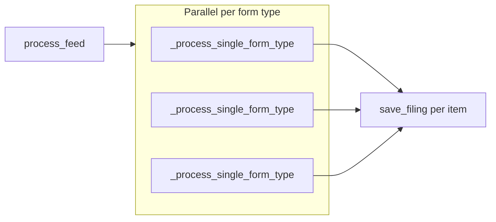

# SEC RSS Parser Services – Step-by-Step Functionality

This document describes the behavior of `services.py` in order, starting from `process_feed` and following each major code path. See [services.py](services.py) for the implementation.

---

## 1. Overview and entry point

### process_feed (SECFeedProcessor)

Entry point for SEC feed processing.

1. Build the list of form types to process: either a single `self.form_type` (if set) or all `FORM_TYPES` from the parser.
2. Run `_process_single_form_type(ft)` for each form type **in parallel** via `ThreadPoolExecutor(max_workers=8)`.
3. As each future completes, aggregate `processed_items` and `new_items_count` from the result.
4. Return a dict: `success`, `message` (with total items and new count), `total_items`, `new_items`; or on exception `success: False` and `error`.

---

## 2. Per–form-type flow: _process_single_form_type

Runs for one form type (e.g. 8-K, DEFM14A). Used by `process_feed` in parallel.

1. **Create parser and fetch feed**  
   Create `SECRSSParser(form_type=form_type)`, set feed URL, call `fetch_rss_feed()`. The feed URL is the SEC Atom URL for that form type (with retries). If the feed is empty, return a failure result with no items.

2. **Parse RSS/Atom**  
   Call `parse_rss_content(rss_content)` → parses XML, then `parse_atom_content(root)` → for each entry `parse_atom_entry(entry)`. Each item has: `title`, `link`, `guid`, `description`, `pubDate`, `form_type`, `accession_number`.

3. **Filter to unique items**  
   Call `_filter_unique_items(items)`:
   - Skip if `accession_number` is in `AccessionLookedUp` (already looked up).
   - Skip if `accession_number` exists in `SECFiling` (and cache it in `AccessionLookedUp`).
   - Skip duplicates within the current batch.
   - For each new accession, add to `AccessionLookedUp` (bulk insert).

4. **Enrich each unique item with HTML data**  
   For each item with a `link`:
   - Call `fetch_and_parse_html(html_url, form_type_from_feed)` to get: form_type, accession_number, filing_date, acceptance_datetime_utc, period, company info, `xbrl_files`, `has_ex21`, `has_ex99_1`, `has_8k_document`.
   - Update `item_data` with this HTML data.
   - For **8-K** only: skip the item if it has neither EX-2.1 nor EX-99.1 nor 8-K document (no further processing for that item).
   - If HTML parsing fails, skip the item.
   - Otherwise append the item to `processed_items`.

5. **Save filings and count new**  
   For each item in `processed_items`, call `save_filing(item)`. Count how many return `True` as `new_items_count`.

6. **Emit stats**  
   If `new_items_count > 0`, call `SECWebSocketService.emit_sec_processing_stats(stats)` with total_processed, new_filings, processing_time, feed_url, form_type.

7. **Return**  
   Return a dict: `form_type`, `processed_items`, `new_items_count`, `success` (and `error` on failure).

---

## 3. save_filing (core per-item pipeline)

Saves one filing and triggers analysis, email, and downstream processing. Order of steps:

### 3.1 Validation

- Require `accession_number`; if missing, log and return `False`.
- If a `SECFiling` with this `accession_number` already exists, return `False`.

### 3.2 8-K summary block (has_8k_document or has_ex99_1, CIK in deals)

**Condition:** Form type is 8-K and (`has_8k_document` or `has_ex99_1`).

- If CIK does **not** match any deal (target or acquirer) via `_cik_matches_deal_target_or_acquirer`, log and skip this block (do not skip the rest of save_filing).
- Else:
  - Resolve matched deal (by target CIK or acquirer CIK), get `deal_id_str`.
  - **If has_8k_document:** Find 8-K file in `xbrl_files`, build full SEC URL (strip `ix?doc=/` if present). Call `summarize_8k_filing` with upload_to_s3, s3_folder "8k". On success: create and save `EightKSummary` (accession, company_name, cik, URLs, ticker, filing_date, items_reported, deal_id, one_line_summary). Call `send_summary_email_via_webhook` with summary_kind '8-K' and L1 headline.
  - **If has_ex99_1:** Same pattern: find EX-99.1 file, `summarize_8k_filing` with s3_folder "99_1", save `Ex99_1Summary`, send summary email with summary_kind 'EX-99.1'.

### 3.3 Analysis by form type

- **8-K with has_ex21 or has_ex99_1:** Call `_analyze_8k_filing(item_data)`. If it returns `False` (e.g. EX-99.1 not merger-related), return `False` from save_filing. Otherwise set `item_data` to the returned value.
- **Proxy forms** (DEFM14A, DEFM14C, PREM14A, PREM14C, S-4, F-4): Call `_analyze_proxy_filing(item_data)` and set `item_data` to the result.
- **Else:** Set `item_data['is_new_deal'] = None` and `item_data['following'] = False`.

### 3.4 Prepare and persist

- Call `_prepare_filing_data(item_data)` (parse dates, set has_htm_files, normalize guid, truncate description).
- Capture EX-99.1-related fields from `item_data` for later email logic (has_ex99_1, is_merger_related, ex99_1_confidence, ex99_1_reasoning, is_target_us_listed, is_target_market_cap_greater_than_100m).
- Restrict `item_data` to keys in `ALLOWED_FILING_FIELDS`.
- Re-check for duplicate `SECFiling` by accession (race condition); if exists, return `False`.
- Create `SECFiling(**item_data)` and save. On duplicate key error, return `False`.

### 3.5 WebSocket

- Build `filing_data` from the saved filing (id, company_name, form_type, accession_number, title, link, description, cik_number, dates, has_htm_files, is_new_deal, following, xbrl_files, document_kind, company_details, etc.).
- Call `SECWebSocketService.emit_new_sec_filing(filing_data)`.
- If `item_data.get('is_new_deal')` is not None, call `SECWebSocketService.emit_sec_analysis_complete(filing_data, 'new_deal' or 'amendment')`.

### 3.6 Email

- Restore the captured EX-99.1 fields onto `item_data` (for _should_send_email and email content).
- Call `_should_send_email(item_data)` → returns `(should_send, email_type, matched_deal)`.
- If `should_send`: call `_send_filing_email(item_data, email_type, matched_deal, filing)`. On success, call `_process_8k_after_email(item_data, filing)`.

### 3.7 Proxy processing

- Call `_process_proxy_if_matched(item_data, filing)` (may call `process_sec_document_helper` if CIK and form type match a deal).

### 3.8 Return

- Return `True`.

---

## 4. Supporting methods

### _analyze_8k_filing

- **EX-2.1 path:** Find all EX-2.1 HTM files in xbrl_files; set `has_htm_files = True`; ensure type field; call `document_analyzer.analyze_filing(item_data)`. Set `is_new_deal`/`following` from result (or None/False if no HTM files).
- **EX-99.1 path:** Find all EX-99.1 HTM files; set `has_htm_files`; call `document_analyzer.analyze_ex99_1_filing(item_data)`. If `is_merger_related` is False, return `False`. If no HTM files, return `False`.
- Returns updated `item_data` or `False`.

### _analyze_proxy_filing

- Normalize `form_type` (strip " - ..." suffix and trailing variant like "-A").
- Call `document_analyzer.analyze_def14a_filing(item_data)`.
- Return updated `item_data` (includes `document_kind` when detected).

### _prepare_filing_data

- Convert `acceptance_datetime_utc` from string to datetime (ISO).
- Parse `filing_date` via `parse_filing_date`.
- Set `has_htm_files` from has_ex21/has_ex99_1 or default False.
- If guid starts with `urn:tag:sec.gov`, replace with `link`.
- Truncate `description` to `MAX_DESCRIPTION_LENGTH`.
- Return updated `item_data`.

### _should_send_email

Rules evaluated in order:

1. **8-K EX-2.1 Definitive Merger:** form_type 8-K, has_htm_files, and document_kind == 'Definitive Merger Agreement' → return `(True, 'ex21_merger', None)`.
2. **8-K EX-99.1 merger-related:** form_type 8-K, has_ex99_1, and is_merger_related → return `(True, 'ex99_1_merger', None)`.
3. **Periodic (8-K, 8-K/A, 10-Q, 10-K) with CIK match:** Look up deal by normalized CIK (target); if found → return `(True, 'standard', matched_deal)`.
4. **Non-8-K with CIK:** Look up deal by target CIK, then acquirer CIK; if found → return `(True, 'standard', matched_deal)`.
5. Otherwise → return `(False, None, None)`.

Deal lookups use `deal_status__in=DEAL_STATUS_OPEN_OR_UNKNOWN` (Open, Unknown).

### _send_filing_email

- **Build email:** For `ex99_1_merger` use `generate_ex99_1_merger_email_html`; else `generate_filing_email_html`. Build payload (subject, html, company_name, accession_number, form_type, filing_url, email_type).
- **Webhook choice:** ex99_1_merger → `N8N_WEBHOOK_URL_8K_SUMMARY`. Standard → if company_details has is_target_us_listed and is_target_market_cap_greater_than_100m use `N8N_WEBHOOK_URL_FILING`, else `N8N_WEBHOOK_URL_8K_SUMMARY`. Send via `send_webhook_notification`.
- **ex21_merger + 8-K:** After main email, fetch SEC filings for the company CIK from 1 year before filing date via `fetch_sec_filings`; build HTML with `generate_sec_filings_email_html` (form_type "8-K(EX-2.1)"); send to N8N_WEBHOOK_URL_8K_SUMMARY.
- **10-K/10-Q standard:** Get announce date from matched_deal or DB lookup by CIK; if missing, try `_extract_announce_date_with_llm(company_details_str)`. Fetch 10-K/10-Q filings from that date (or 1 year before today). For each filing not already in `TenKTenQSummary`, persist a `TenKTenQSummary` record. Generate SEC filings email and send to N8N_WEBHOOK_URL_8K_SUMMARY.

### _process_8k_after_email

Runs only when all are true:

- form_type is 8-K;
- has EX-2.1 (in xbrl_files or has_ex21);
- document_kind is 'Definitive Merger Agreement';
- company_details has is_target_market_cap_greater_than_100m and is_target_us_listed.

Steps: Find EX-2.1 HTM URL via `find_file_by_type`, build full URL; get sec_filing_id from saved filing; call `process_8k_document_helper(cik_number, company_name, sec_filing_id, filing_date, form_type, ex21_url, item_data, company_details)` (spawns thread for `process_8k_document_async`).

### _process_proxy_if_matched

- If no cik_number or form_type not in PROXY_FORM_TYPES, return.
- Normalize CIK; look up deal by target CIK, then acquirer CIK (Open/Unknown only).
- If matched: find proxy HTM file in xbrl_files via `find_file_by_type(..., PROXY_FORM_TYPES)`; build full SEC URL; call `process_sec_document_helper` with cik_number, company_name, sec_filing_id, filing_date, form_type, proxy_sec_url, deal_id.

---

## 5. Async 8-K document processing

### process_8k_document_helper

- Starts a **daemon thread** that runs `process_8k_document_async(ex21_url, cik_number, company_name, sec_filing_id, filing_date, item_data, company_details)`.
- Returns a dict with status 'In Progress', message, company_name, cik_number, sec_filing_id, ex21_url (or None on error).

### process_8k_document_async

1. Build payload from `company_details`: target_cik, target_name, acquirer_cik, acquirer_name, target_ticker, acquirer_ticker, announce_data (from filing_date).
2. Validate required fields (target_cik, announce_data, target_name); if missing, send "Fail" via DocumentProcessingService and return.
3. Send "In Progress" via DocumentProcessingService.
4. POST to Node API `deal/process-with-url` with url, target_cik, announce_data, target_name, acquired_name, sec_filing_id, acquirer_cik, target_ticker, acquirer_ticker, is_from_ui=False.
5. On success (response has status and data.jsonUrl):
   - Get `deal_id` and `jsonUrl`.
   - Call `DocumentProcessingService.process_document(file_url=json_url, deal_id=deal_id, sec_filing_id=sec_filing_id, embed_data=True)`.
   - Start a **daemon thread** for `generate_8k_summary_async(deal_id, company_name, form_type, cik_number, sec_url, accession_number)`.
6. On failure, send "Fail" with an appropriate message.

### generate_8k_summary_async

- Poll `ProcessingJob` by deal_id (e.g. every 30s, up to 60 attempts).
- When job has `schema_results` and `embedding_status == 'COMPLETED'`: set job summary_status to PROCESSING; call `SummaryGenerationService.generate_summary_engine` (deal_id, temperature=0, provider='openai', model='gpt-5.2-2025-12-11'); on success set job summary_docx_url and summary_status COMPLETED; call `send_8k_summary_email(...)` with summary_kind "EX-2.1".

---

## 6. Parser and HTML parsing (reference)

### SECRSSParser

- **Initialization:** Optional form_type; sets feed_url for that form (SEC browse-edgar Atom URL); creates a requests session with retry strategy (3 retries, backoff, status 429/5xx).
- **fetch_rss_feed:** GET feed_url with headers; 3 retries with progressive delay; returns response text or None.
- **parse_rss_content:** Parse XML with ET, call `parse_atom_content(root)`.
- **parse_atom_content:** Find all entry elements (with or without Atom namespace); for each, `parse_atom_entry` → item with title, link, guid, description, pubDate, form_type (from category term), accession_number (from guid regex).
- **parse_atom_entry:** Extract title, link (alternate or first link), id→guid, summary→description, updated→pubDate; form_type from first category term; accession from guid pattern `accession-number=(\d{10}-\d{2}-\d{6})`.
- **fetch_and_parse_html:** GET html_url, parse with BeautifulSoup. Extract: form_type (companyInfo/identInfo or formName), accession (secNum or URL), filing_date / acceptance_datetime_utc / period (infoHead/info divs), company info (_extract_company_info), xbrl_files (_extract_xbrl_files). Set has_ex21, has_ex99_1, has_8k_document from xbrl_files. Fallbacks: form_type from page title; accession from URL. Returns dict or None if required fields missing.

---

## 7. Constants and key helpers

### Constants

- **FORM_TYPES:** 8-k, DEFM14A, DEFM14C, PREM14A, PREM14C, S-4, S-4/A, F-4, F-4/A, SC 14D9, SC 14D9/A, 10-Q, 10-K.
- **PROXY_FORM_TYPES:** DEFM14A, DEFM14C, PREM14A, PREM14C, S-4, F-4.
- **PERIODIC_FORM_TYPES:** 8-K, 8-K/A, 10-Q, 10-K.
- **DEAL_STATUS_OPEN_OR_UNKNOWN:** ["Open", "Unknown"] (for deal matching).
- **ALLOWED_FILING_FIELDS:** Set of field names allowed when saving SECFiling (title, link, guid, description, pubDate, company_name, form_type, filing_date, cik_number, accession_number, etc.).

### Helpers (module-level)

- **normalize_cik:** Pad CIK to 10 digits.
- **parse_filing_date:** Parse string or datetime to datetime; formats include %Y-%m-%d, %m/%d/%Y, %Y-%m-%d %H:%M:%S.
- **build_full_sec_url:** Prepend SEC_BASE_URL if URL is relative.
- **find_file_by_type:** Find first file in xbrl_files matching type/description and extension (e.g. .htm).
- **extract_accession_from_guid:** Regex `accession-number=([\d-]+)` from guid.
- **send_webhook_notification:** POST JSON payload to webhook URL; logs and raises on failure.
- **send_summary_email_via_webhook:** Build 8-K/EX-99.1 summary email via `generate_8k_99_1_summary_email_html`, send to N8N_WEBHOOK_URL_8K_SUMMARY.

### External dependencies (how services.py uses them)

- **SECDocumentAnalyzer** (document_analyzer): `analyze_filing`, `analyze_ex99_1_filing`, `analyze_def14a_filing`.
- **fetch_sec_filings** (sec_Last_Year): Fetch SEC filings for a CIK from a start date, optional form_types.
- **summarize_8k_filing** (Eight_k_summary): Summarize 8-K or EX-99.1 URL, upload to S3, return s3_url, s3_json_url, ticker, filing_date, items_reported, L1_headline.
- **DocumentProcessingService** (document_processor.services): `process_document`, `_send_sec_filing_event`.
- **process_sec_document_helper** (proxy_processor.views): Process proxy SEC document with deal_id.
- **call_node_api** (node_proxy.utils): POST to Node API (e.g. deal/process-with-url).
- **SummaryGenerationService** (document_processor.services): `generate_summary_engine`.
